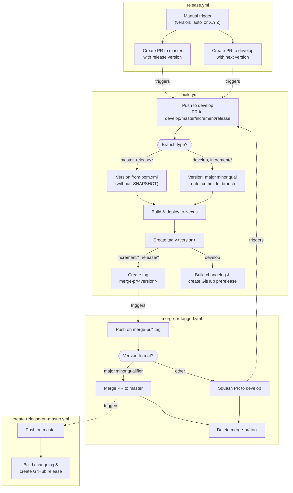
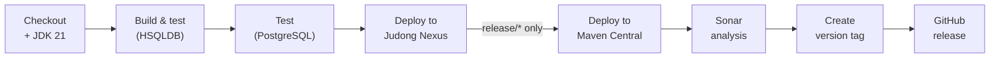

# Development Version and Branch Handling

This document describes the branching strategy, version numbering, and CI/CD automation for the JUDO Runtime Core JSL project.

## Branches

The versioning policy follows a [GitFlow](https://www.atlassian.com/git/tutorials/comparing-workflows/gitflow-workflow) model. Each branch type serves a specific purpose in the development lifecycle:

| Branch Pattern | Base | Purpose |
|---------------|------|---------|
| `develop` | — | Main development branch; contains latest development sources |
| `feature/JNG-xxx_summary` | `develop` | New features for the next release |
| `(release/)X.Y.Z` | `develop` | Release stabilization (`release/` prefix reserved for CI) |
| `bugfix/JNG-xxx_summary` | release branch | Bug fixes applied to a release under testing |
| `support/JNG-xxx_summary` | release branch | Minor changes to a previous release |
| `master` | — | Latest released sources |
| `hotfix/JNG-xxx_summary` | `master` | Critical fixes applied to both release and master |

### Branch Flow

```mermaid
gitGraph
    commit id: "init"
    branch develop
    checkout develop
    commit id: "dev-1"
    branch feature/JNG-1
    commit id: "feat-1"
    commit id: "feat-2"
    checkout develop
    merge feature/JNG-1 id: "merge-feat-1"
    branch feature/JNG-2
    commit id: "feat-3"
    checkout develop
    merge feature/JNG-2 id: "merge-feat-2"
    branch release/1.0-beta1
    commit id: "rc-1"
    branch bugfix/JNG-4
    commit id: "fix-1"
    checkout release/1.0-beta1
    merge bugfix/JNG-4 id: "merge-fix"
    checkout develop
    merge release/1.0-beta1 id: "merge-release"
    checkout master
    merge release/1.0-beta1 id: "release-1.0"
```

## Version Numbers

Version numbers follow semantic versioning with these rules:

| Event | Version Change | Example |
|-------|---------------|---------|
| Start `feature/` branch | No change | stays at `1.0.0-SNAPSHOT` |
| Start release branch from `develop` | 2nd number incremented on `develop` | `develop` becomes `1.1.0-SNAPSHOT` |
| Start `bugfix/` branch | No change | applied on release branch before merging to master |
| Start `support/` branch | 3rd number incremented | `1.0.1-SNAPSHOT` |
| Start `hotfix/` branch | 4th number incremented | `1.0.0.1-SNAPSHOT` |

### CI Version Calculation

On non-release branches, versions include build metadata for traceability:

- **Release branches → master**: `major.minor.qualifier` (e.g., `1.0.0`)
- **develop / feature branches**: `major.minor.qualifier.YYYYMMDD_HHMMSS_commitId_branchName` (e.g., `1.0.3.20260202_151641_1f52a549_develop`)

## GitHub Actions Workflows

The CI/CD system uses several interconnected GitHub Actions workflows that trigger each other via tags:



### Build Pipeline Details

The `build.yml` workflow executes these steps:



Key build commands used by CI:

```bash
# Build & test with HSQLDB
./mvnw -B -T 4 -Drevision=<version> -Ddialect=hsqldb clean install

# Test with PostgreSQL
./mvnw -B -T 4 -Drevision=<version> -Ddialect=postgresql surefire:test

# Deploy (skip tests)
./mvnw -B -T 4 -Drevision=<version> -DdeployOnly -Dmaven.test.skip=true \
  -P"sign-artifacts,release-judong" deploy
```

## Development Rules

> **Important:** There is no commit without a ticket number. Every pull request or commit must include a JIRA reference (`JNG-xxx`).

Issue tracking: [JIRA Dashboard](https://blackbelt.atlassian.net/jira/dashboards)
