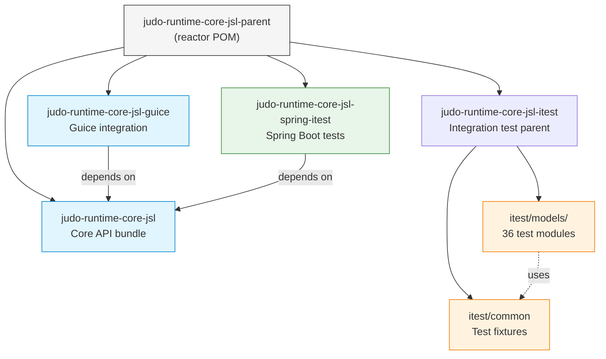
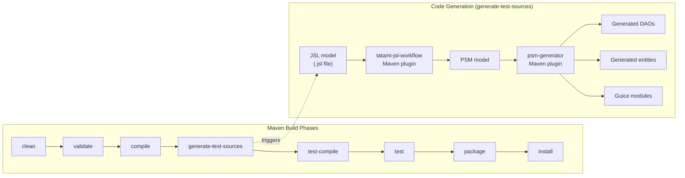
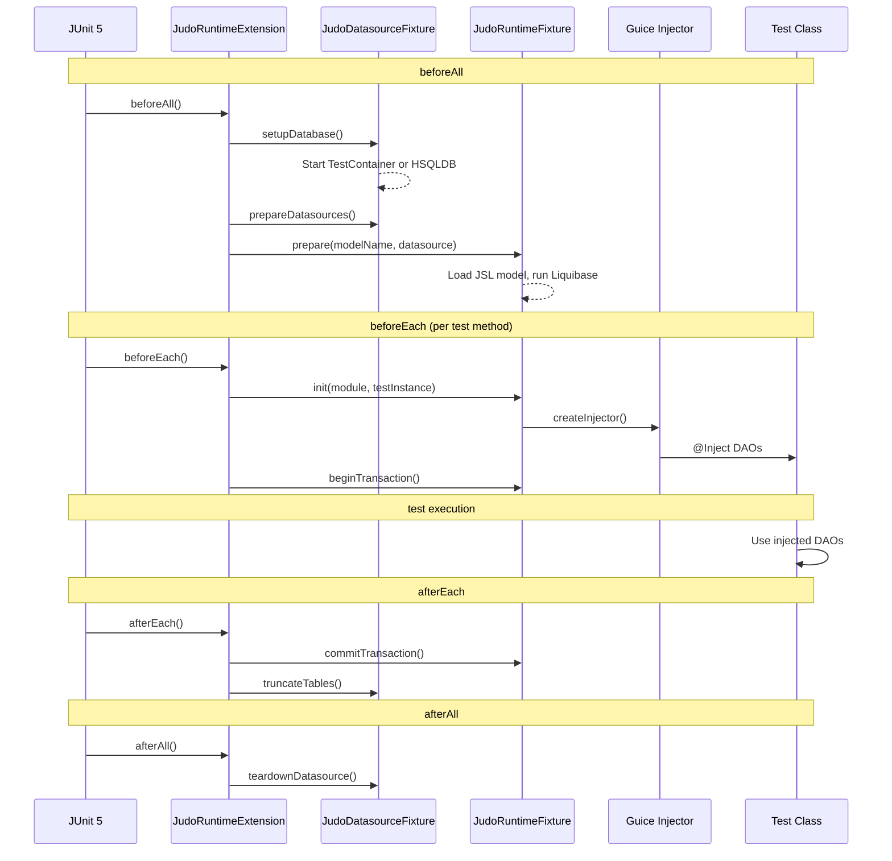

# Contributing to JUDO Runtime Core JSL

Thank you for your interest in contributing! This guide covers everything you need to get started.

## Development Environment

### Prerequisites

| Requirement | Version | Notes |
|------------|---------|-------|
| Java JDK | 21 | Zulu distribution recommended |
| Maven | 3.9.4+ | Wrapper (`./mvnw`) included |
| Docker | Latest | Required for PostgreSQL integration tests via TestContainers |

For the full environment requirements, see the parent project's [CONTRIBUTING guide](https://github.com/BlackBeltTechnology/judo-community/blob/develop/CONTRIBUTING.adoc).

## Project Architecture

This is a multi-module Maven project with four top-level modules. Understanding how they relate helps you decide where to make changes:



### Build Lifecycle

The build involves a model transformation pipeline that runs during the `generate-test-sources` phase. Understanding this pipeline is essential when adding new test models:



## Build Commands

```bash
# Full build with HSQLDB tests (fastest for development)
./mvnw clean install -Ddialect=hsqldb

# Full build with PostgreSQL tests (requires Docker)
./mvnw clean install -Ddialect=postgresql

# Build without tests
./mvnw clean install -DskipTests

# Run tests only (after a prior build)
./mvnw surefire:test -Ddialect=hsqldb

# Run a single test module
./mvnw test -pl judo-runtime-core-jsl-itest/models/PrimitivesModel -Ddialect=hsqldb

# Run a single test class
./mvnw test -pl judo-runtime-core-jsl-itest/models/PrimitivesModel \
  -Dtest=PrimitivesTest -Ddialect=hsqldb

# Parallel build (CI uses 4 threads)
./mvnw clean install -T 4 -Ddialect=hsqldb

# Skip itest modules (build core only)
./mvnw clean install -DskipModules=true
```

## Test Architecture

Each integration test module follows a consistent pattern. Here is the interaction flow during test execution:



### Adding a New Test Model

1. Create a new directory under `judo-runtime-core-jsl-itest/models/YourModel/`
2. Add a `pom.xml` modeled after an existing test module (e.g., `PrimitivesModel/pom.xml`)
3. Write your JSL model file in `src/test/resources/YourModel.jsl`
4. Create test classes in `src/test/java/` using `@RegisterExtension` with `JudoRuntimeExtension`
5. Register the module in `judo-runtime-core-jsl-itest/pom.xml`

## Submitting Issues

Before submitting, search the [issue tracker](https://github.com/BlackBeltTechnology/judo-runtime-core-jsl/issues) for existing reports.

When filing a bug, include:
- Output of `java -version` and `mvn -version`
- The `pom.xml` or `.flattened-pom.xml` (when applicable)
- A minimal reproducing use-case

File new issues via the [issue form](https://github.com/BlackBeltTechnology/judo-runtime-core-jsl/issues/new/choose).

## Submitting a Pull Request

This project follows [GitHub's standard forking model](https://guides.github.com/activities/forking/). Fork the project, create a feature branch, and submit a pull request.

> **Important:** Every commit must reference a JIRA ticket number (`JNG-xxx`). There is no commit without a ticket number.
