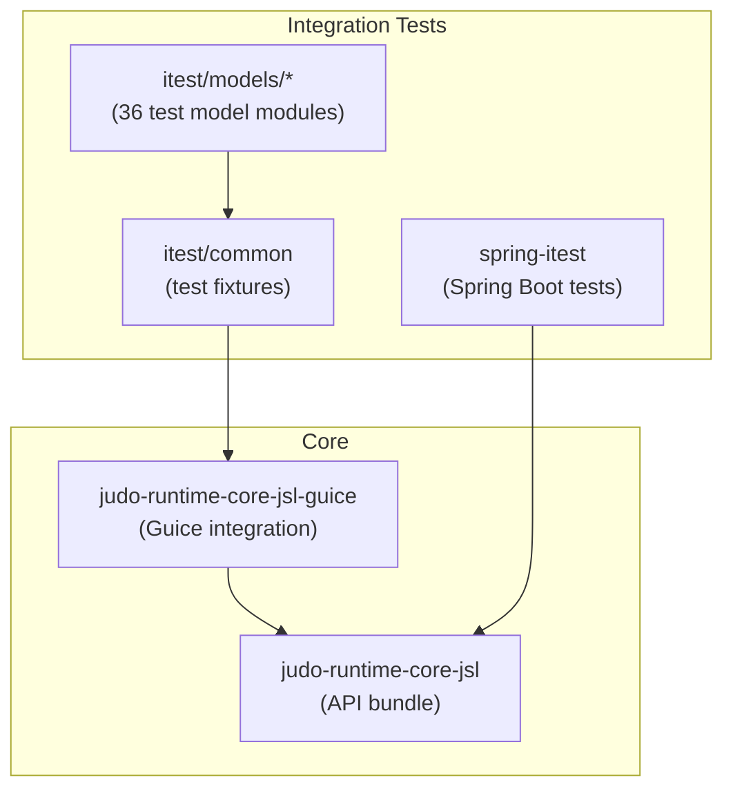
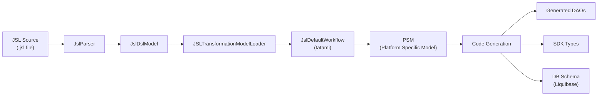
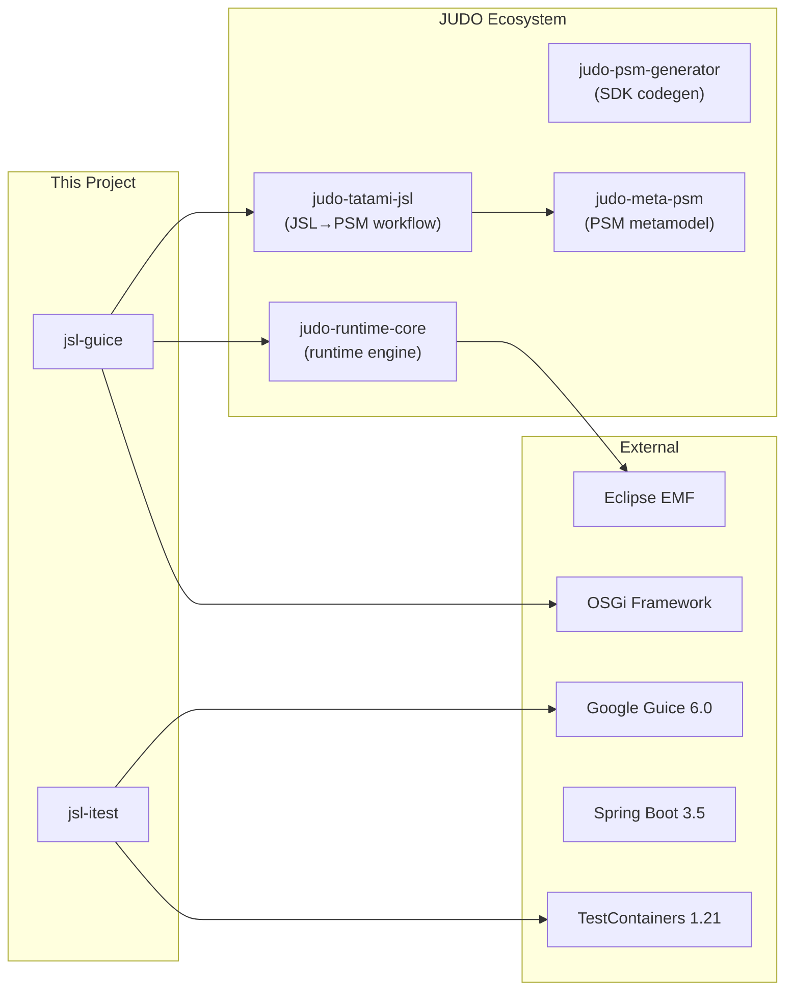

# JUDO Runtime Core JSL

[](https://github.com/BlackBeltTechnology/judo-runtime-core-jsl/actions/workflows/build.yml)

## What This Project Does

This module extends [judo-runtime-core](https://github.com/BlackBeltTechnology/judo-runtime-core) by adding support for **JSL (JUDO Specific Language)** input sources. JSL is a domain-specific language for defining entities, transfer objects, relationships, and business logic. This project handles the full pipeline from parsing JSL models through to generated runtime code — including DAO classes, SDK types, and database schema — for both Guice and Spring dependency injection frameworks.

It is a building block of the [judo-community](https://github.com/BlackBeltTechnology/judo-community) aggregator project.

## Module Overview



| Module | Purpose |
|--------|---------|
| `judo-runtime-core-jsl` | Core API definitions (OSGi bundle) |
| `judo-runtime-core-jsl-guice` | Guice DI integration — contains `JSLTransformationModelLoader` for loading and transforming JSL models |
| `judo-runtime-core-jsl-itest/common` | Shared test infrastructure: `JudoRuntimeExtension`, datasource fixtures, TestContainers setup |
| `judo-runtime-core-jsl-itest/models/*` | 36 integration test modules, each with a JSL model definition and JUnit 5 tests |
| `judo-runtime-core-jsl-spring-itest` | Spring Boot integration tests demonstrating DAO usage and transaction management |

## Model Transformation Pipeline

The core value of this project is the end-to-end pipeline that takes a JSL source file and produces a running, testable application with generated DAOs and database schema:



## Quick Start

```bash
# Full build and test with HSQLDB (in-memory)
./mvnw clean install -Ddialect=hsqldb

# Test with PostgreSQL (requires Docker for TestContainers)
./mvnw clean install -Ddialect=postgresql

# Run a single test module
./mvnw test -pl judo-runtime-core-jsl-itest/models/PrimitivesModel -Ddialect=hsqldb

# Run a single test class
./mvnw test -pl judo-runtime-core-jsl-itest/models/PrimitivesModel \
  -Dtest=PrimitivesTest -Ddialect=hsqldb
```

## Key Dependencies



## Contributing

See [CONTRIBUTING.md](CONTRIBUTING.md) for development setup, submission guidelines, and coding conventions.

## License

This project is licensed under the [Eclipse Public License - v 2.0](https://www.eclipse.org/legal/epl-2.0/).
